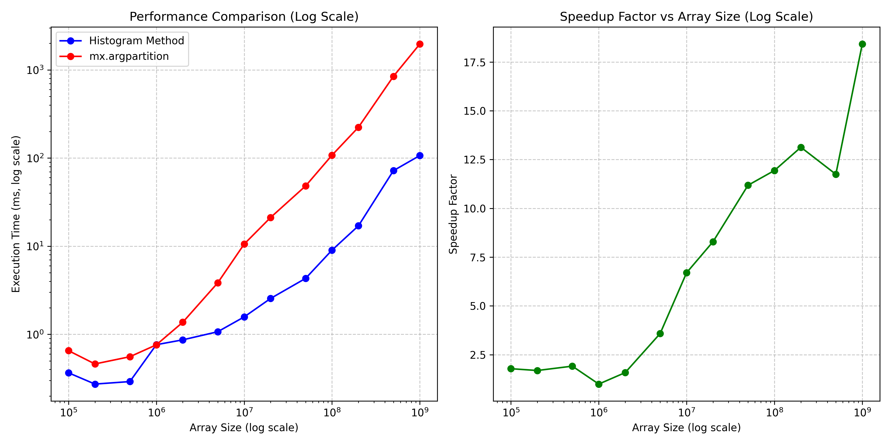

# Binary Embeddings Search

### (Claudeslop README)

A high-performance text similarity search system using binary embeddings and GPU-accelerated search algorithms. It lets one search all of enwik9 (3 million chunks of 512 characters each) in sub 50ms on an M3 Max.

## Overview

This repository implements and benchmarks an efficient approach to text similarity search using:

1. **Binary embeddings**: Dense vector representations converted to binary format for memory efficiency
2. **GPU-accelerated similarity search**: Using MLX and Metal kernels for fast computation
3. **Histogram-based top-k selection**: A novel approach that dramatically outperforms traditional methods

The system is designed to efficiently search through large text corpora (such as enwik7/enwik9 datasets) and find semantically similar content.

## Performance Results

The graph above demonstrates the significant performance advantages of our histogram-based method compared to traditional argpartition:

- **Left graph**: Execution time comparison on log scale showing the histogram method consistently outperforming standard methods across all array sizes
- **Right graph**: Speedup factor showing up to 80x performance improvement for certain array sizes

The performance gap widens as array size increases, making this approach particularly valuable for large-scale similarity search applications.

## Key Components

- `binary_embedding_search.py`: Core implementation of binary similarity search using MLX
- `hist_search.py`: Histogram-based top-k selection algorithm implementation
- `bench.py`: Benchmarking code for comparing methods at different scales
- `search_gui.py`: User interface for interactive similarity search

## Features

- Fast binary similarity computation using bitwise operations and popcount
- GPU-acceleration via Metal kernels
- Memory-efficient representation of embeddings
- Scales efficiently to billion-element arrays
- Interactive search interface for exploring results

## Datasets

The repository includes tools for working with Wikipedia-based test datasets:
- enwik7, enwik8, enwik9: Increasingly large subsets of Wikipedia text
- Support for chunk-based processing and embedding generation

## Usage

1. Generate embeddings from text using `embed-binary.py`
2. Run similarity searches with `binary_embedding_search.py` 
3. Use the GUI interface with `search_gui.py` for interactive exploration
4. Run benchmarks with `bench.py` to compare performance

## Requirements

- Python 3.x
- MLX (Apple's machine learning framework)
- mlx-embeddings
- NumPy
- tkinter (for GUI)